<<<<<<< HEAD
{width="8.51388888888889in"
height="5.457492344706911in"}{width="6.947222222222222in"
height="0.5851870078740158in"}{width="6.947222222222222in"
height="0.17505577427821523in"}

  {width="8.515277777777778in" height="6.345833333333333in"}
  ---------------------------------------------------------------------------------------------------------------------------

+----------------------------------------------------------------------+
| > **Teaching Material for Development of Wireless Sensor Nodes for** |
| >                                                                    |
| > **Real-Time Environment Monitoring using IoT**                     |
|                                                                      |
| 1                                                                    |
+----------------------------------------------------------------------+

**Teaching Material for Development of Wireless Sensor Nodes for
Real-Time**

**Environment Monitoring using IoT**

by

**Tahmid Sajin,**

**4th Year Electrical Engineering Student**

Email:

In collaboration with:

**Tamer Almaaitah,**

**PhD Candidate**

Under Supervision of:

**Dr. Darko Joksimovic**

**Associate Professor**

**April 2021**

**Ryerson University**

2

**Table of Contents**

+-------------------------------------------------------------+----+
| > 1\. Introduction                                          | 5  |
+=============================================================+====+
| > 1.1 Purpose of the system                                 | 5  |
+-------------------------------------------------------------+----+
| > 1.2 Objectives and success criteria of the project        | 5  |
+-------------------------------------------------------------+----+
| > 1.3 Definitions, acronyms and abbreviations               | 6  |
+-------------------------------------------------------------+----+
| > 1.4 Hardware components                                   | 8  |
+-------------------------------------------------------------+----+
| > 1.5 Programming languages                                 | 9  |
+-------------------------------------------------------------+----+
| > 1.5.1 Go SDK                                              | 9  |
+-------------------------------------------------------------+----+
| > 1.5.2 Arduino                                             | 9  |
+-------------------------------------------------------------+----+
| > 1.6 Functional requirements                               | 9  |
+-------------------------------------------------------------+----+
| > 1.6.1 eTape water level measurement                       | 9  |
+-------------------------------------------------------------+----+
| > 1.6.2 SHT31 temperature and humidity measurement          | 10 |
+-------------------------------------------------------------+----+
| > 1.6.3 LSN50 prolonged battery life                        | 10 |
+-------------------------------------------------------------+----+
| > 1.6.4 Protective housing                                  | 10 |
+-------------------------------------------------------------+----+
| > 1.6.5 LSN50 LoRaWAN capability                            | 10 |
+-------------------------------------------------------------+----+
| > 1.7 Non-functional requirements                           | 10 |
+-------------------------------------------------------------+----+
| > 1.7.1 Usability                                           | 10 |
+-------------------------------------------------------------+----+
| > 1.7.2 reliability and performance                         | 10 |
+-------------------------------------------------------------+----+
| > 1.7.3 Accuracy                                            | 11 |
+-------------------------------------------------------------+----+
| > 1.7.4 Implementation and modifiable programming interface | 11 |
+-------------------------------------------------------------+----+
| > 2\. Proposed System                                       | 11 |
+-------------------------------------------------------------+----+
| > 2.1 Hardware                                              | 12 |
+-------------------------------------------------------------+----+
| > 2.1.1 LSN50                                               | 12 |
+-------------------------------------------------------------+----+
| > 2.1.2 eTape water level sensor                            | 13 |
+-------------------------------------------------------------+----+
| > 2.1.3 SHT31 temperature and humidity sensor               | 15 |
+-------------------------------------------------------------+----+
| > 2.2 Software                                              | 15 |
+-------------------------------------------------------------+----+
| > 2.2.1 The Things Network                                  | 15 |
+-------------------------------------------------------------+----+
| > 3\. LSN50 connection to The Things Network                | 15 |
+-------------------------------------------------------------+----+
| > 3.1 LSN50 keys                                            | 16 |
+-------------------------------------------------------------+----+
| > 3.2 Gateway                                               | 16 |
+-------------------------------------------------------------+----+
| > 4\. eTape connection to LSN50                             | 16 |
+-------------------------------------------------------------+----+
| > 4.1 Hardware                                              | 17 |
+-------------------------------------------------------------+----+
| > 4.1.1 Breadboard wiring                                   | 17 |
+-------------------------------------------------------------+----+
| > 4.1.2 eTape housing setup                                 | 18 |
+-------------------------------------------------------------+----+

3

+--------------------------------------------------------------+------+
| > 4.2 Software 19                                            | > 19 |
+==============================================================+======+
| > 4.2.1 Programming of eTape 19                              | > 19 |
+--------------------------------------------------------------+------+
| > 4.2.3 Measurement of water levels 21                       | > 21 |
+--------------------------------------------------------------+------+
| > 5\. SHT31 connection to LSN50 23                           | > 23 |
+--------------------------------------------------------------+------+
| > 5.1 Hardware 24                                            | > 24 |
+--------------------------------------------------------------+------+
| > 5.1.1 Wiring 24                                            | > 24 |
+--------------------------------------------------------------+------+
| > 5.2 Software 25                                            | > 25 |
+--------------------------------------------------------------+------+
| > 5.2.1 Measurement of temperature and humidity 26           | > 26 |
+--------------------------------------------------------------+------+
| > 6\. Visualization platform of LSN50 27                     | > 27 |
+--------------------------------------------------------------+------+
| > 6.1 Visualization of eTape sensor water levels 27          | > 27 |
+--------------------------------------------------------------+------+
| > 6.2 Visualization of SHT31 sensor temperature and humidity | > 31 |
| > 31                                                         |      |
+--------------------------------------------------------------+------+
| > 6.3 Downloading of sensor data 34                          | > 34 |
+--------------------------------------------------------------+------+
| > 6.4 Sensor data storage 38                                 | > 38 |
+--------------------------------------------------------------+------+
| > 7\. Parameter measurements 38                              | > 38 |
+--------------------------------------------------------------+------+
| > 7.1 Received signal strength indicator 38                  | > 38 |
+--------------------------------------------------------------+------+
| > 7.2 Signal-to-noise ratio 40                               | > 40 |
+--------------------------------------------------------------+------+
| > 8\. Conclusion 41                                          | > 41 |
+--------------------------------------------------------------+------+
| > 8.1 Potential roadblocks and challenges 41                 | > 41 |
+--------------------------------------------------------------+------+
| > 8.2 Further recommendations 41                             | > 41 |
+--------------------------------------------------------------+------+
| > 9\. Appendix 42                                            | > 42 |
+--------------------------------------------------------------+------+
| > 9.1 Programming Code 42                                    | > 42 |
+--------------------------------------------------------------+------+
| > **9.1.1 eTape sensor payload decoder function code as used | > 42 |
| > in this teaching material**                                |      |
+--------------------------------------------------------------+------+
| > **9.1.2 Alternative eTape sensor payload decoder function  | > 44 |
| > code (not used in this teaching material)**                |      |
+--------------------------------------------------------------+------+
| > **9.1.3 12-inch eTape sensor payload decoder function with | > 47 |
| > if-statements**                                            |      |
+--------------------------------------------------------------+------+
| > **9.1.4 SHT31 sensor payload decoder function as used in   | > 49 |
| > this teaching material** 49                                |      |
+--------------------------------------------------------------+------+

4

> **1. Introduction**
>
> The development of wireless sensor nodes specific for environmental
> monitoring using the Long-Range

Wireless Access Network (LoRaWAN) has become a focus in the Internet of
Things (IoT) industry. Environmental

monitoring requires various climatic and environmental parameters such
as temperature, humidity, water level and

soil moisture. Throughout this project, the utilization of two specific
sensors, the eTape water level sensor and the

SHT31 temperature and humidity sensor, has provided the measurement of
these environmental parameters needed

for monitoring using LoRaWAN. These two sensors were used in this
project with a Dragino supplied LoRaWAN

sensor node, the LSN50 and a supplied gateway. After necessary
connection and programming between these

> sensors, the sensor node and gateway, monitoring could reflect the
> desired environmental parameters.
>
> **1.1 Purpose of the system**
>
> The overall monitoring system consists of two separate monitoring
> subsystems. Firstly, the eTape sensor

and the LSN50 will be connected to a gateway to deliver water level data
to The Things Network (TTN). This data

will then be visualized using Cayenne My Devices, such that various
water levels and LSN50 battery values are

measured in different nodes with respect to time. Secondly, the SHT31
sensor will also be connected to the LSN50

and a gateway to deliver temperature and humidity data of different
nodes. This data will also be visualized with

> respect to time.
>
> **1.2 Objectives and success criteria of the project**
>
> The objectives and success criteria of this project can be summarized
> as shown in Table 1. The data transfer

between the sensors to the TTN is mainly concerned, as it is the
majority of the work in the monitoring system. The

> building of the housing for sensors and the visualization is essential
> in the end stages of the project.

5

**Table 1:** Objectives and success criteria of the project.

+----------------------------------+----------------------------------+
| **Objectives of the project**    | **Success criteria of the        |
|                                  | project**                        |
+==================================+==================================+
| Build an appropriate housing of  | Secure and sturdy structure of   |
| the sensors                      | the sensors                      |
+----------------------------------+----------------------------------+
| Collect data of the temperature  | Accuracy of temperature and      |
| and humidity                     | humidity data                    |
+----------------------------------+----------------------------------+
| Send data of the temperature and | Appropriate data reception in    |
| humidity to TTN                  | TTN using LoRaWAN                |
+----------------------------------+----------------------------------+
| Collect data of the water level  | Accuracy of water level data     |
+----------------------------------+----------------------------------+
| Send data of the water level to  | Appropriate data reception in    |
| TTN                              | TTN using LoRaWAN                |
+----------------------------------+----------------------------------+
| Visualize the two data in        | Succinct and detailed            |
| Cayenne My Devices               | visualization to display         |
|                                  |                                  |
|                                  | meaningful information of data   |
+----------------------------------+----------------------------------+

> **1.3 Definitions, acronyms and abbreviations**
>
> The following contains the tables of the definitions, acronyms and
> abbreviations. Tables 2a, 2b and 2c

contain the various definitions, acronyms, and abbreviations found
within this teaching material and while

> completing the project.

**Table 2a:** Definitions, acronyms and abbreviations of IoT

+-------------------+-------------------------------------------------+
| **Definitions,**  | **Description**                                 |
|                   |                                                 |
| **acronyms and**  |                                                 |
|                   |                                                 |
| **abbreviations** |                                                 |
+===================+=================================================+
| IoT               | The Internet of Things (IoT) consists of        |
|                   | components of a system such as                  |
|                   |                                                 |
|                   | computing devices, digital machines and         |
|                   | objects, which are given the ability            |
|                   |                                                 |
|                   | and feature to transfer data over a network     |
|                   | requiring a human to computer                   |
|                   |                                                 |
|                   | interaction. The IoTs used in this project are  |
|                   | both the sensors and the LSN50.                 |
|                   |                                                 |
|                   | https://internetofthingsagend                   |
|                   | a.techtarget.com/definition/Internet-of-Things- |
|                   |                                                 |
|                   | IoT                                             |
+-------------------+-------------------------------------------------+

6

+---------+-----------------------------------------------------------+
| LoRaWAN | Extended Range Wireless Access Network (LoRaWAN) is a     |
|         | networking                                                |
|         |                                                           |
|         | protocol designed to connect IoTs within a specific       |
|         | length range wirelessly.                                  |
|         |                                                           |
|         | LoRaWAN products such as the LSN50 will be used in this   |
|         | project.                                                  |
|         |                                                           |
|         | https://lora-alliance.org/about-lorawan/                  |
+=========+===========================================================+
| TTN     | The Things Network (TTN) is a global community and an     |
|         | open-source IoT                                           |
|         |                                                           |
|         | cloud service utilizing LoRaWAN. TTN will be used in this |
|         | project to receive                                        |
|         |                                                           |
|         | the sensor data by using an appropriate LoRaWAN gateway.  |
+---------+-----------------------------------------------------------+
| Dragino | Dragino is an open-source hardware supplier that provides |
|         | LoRaWAN                                                   |
|         |                                                           |
|         | products as the LSN50. The LSN50 will be used as the      |
|         | sensor nodes in this                                      |
|         |                                                           |
|         | project.                                                  |
+---------+-----------------------------------------------------------+

**Table 2b:** Hardware definitions, acronyms and abbreviations

+----------------------+----------------------------------------------+
| **Definitions, and** | **Description**                              |
|                      |                                              |
| **abbreviations**    |                                              |
+======================+==============================================+
| LSN50                | a Long Range LoRa Sensor Node designed for   |
|                      | outdoor use and powered by Li/SOCl2          |
|                      |                                              |
|                      | battery for long-term use and to facilitate  |
|                      | developers to deploy industrial level LoRa   |
|                      | and                                          |
|                      |                                              |
|                      | IoT solutions quickly                        |
+----------------------+----------------------------------------------+
| Gateway              | Intermediaries that allow sensing devices to |
|                      | transmit data to the cloud                   |
+----------------------+----------------------------------------------+
| eTape                | Sensor with a resistive output that varies   |
|                      | with the level of the fluid                  |
+----------------------+----------------------------------------------+
| SHT31                | Temperature and humidity sensor has an       |
|                      | excellent ±2% relative humidity and          |
|                      |                                              |
|                      | ±0.3°C accuracy for most uses.               |
+----------------------+----------------------------------------------+

**Table 2c:** Software definitions, acronyms and abbreviations

+--------------------+-------------------------------------+
| **Definitions,**   | **Description**                     |
|                    |                                     |
| **acronyms, and**  |                                     |
|                    |                                     |
| **abbreviations**  |                                     |
+====================+=====================================+
| Cayenne My Devices | Visualization platform for IoT data |
+--------------------+-------------------------------------+
| ADC_CH0V           | Analog-to-digital converter         |
+--------------------+-------------------------------------+

7

+---------+-----------------------------------------------------------+
| BatV    | Battery voltage                                           |
+=========+===========================================================+
| Go SDK  | Programming language                                      |
+---------+-----------------------------------------------------------+
| Arduino | an open-source electronics platform based on easy-to-use  |
|         | hardware and                                              |
|         |                                                           |
|         | software.                                                 |
+---------+-----------------------------------------------------------+

> **1.4 Hardware components**
>
> As shown in the following, Table 3 contains all the hardware
> components needed for this project. The
>
> hardware components were needed for the system\'s different
> components, such as for the water level sensing,
>
> temperature and humidity sensing, data transfer to TTN and the overall
> housing of the sensors.

**Table 3:** Hardware components of the project.

+------------------+------------------+------------------------------+
| Component        | Link             | Description                  |
+==================+==================+==============================+
| LSN50            | LSN50 node       | a Long Range LoRa Sensor     |
|                  |                  | Node designed for outdoor    |
|                  |                  | use and powered              |
|                  |                  |                              |
|                  |                  | by Li/SOCl2 battery for      |
|                  |                  | long-term use and to         |
|                  |                  | facilitate developers to     |
|                  |                  |                              |
|                  |                  | deploy industrial level LoRa |
|                  |                  | and IoT solutions quickly    |
+------------------+------------------+------------------------------+
| eTape sensor     | 5-inch eTape     | Sensor with a resistive      |
|                  |                  | output that varies with the  |
|                  |                  | level of the                 |
|                  |                  |                              |
|                  |                  | fluid                        |
+------------------+------------------+------------------------------+
| SHT31 sensor     |                  | Temperature and humidity     |
|                  |                  | sensor has an excellent ±2%  |
|                  |                  | relative                     |
|                  |                  |                              |
|                  |                  | humidity and ±0.3°C accuracy |
|                  |                  | for most uses.               |
+------------------+------------------+------------------------------+
| Breadboard       | Breadboard       | To connect many wires with   |
|                  |                  | the resistor                 |
+------------------+------------------+------------------------------+
| Jumper wires and | 1 m jumper wires | Jumper wires                 |
|                  |                  |                              |
| resistors        |                  |                              |
+------------------+------------------+------------------------------+
| Wiring shielding | Wiring shielding | Wiring covers to protect the |
|                  |                  | wires from weathering        |
| and covers       | and covers       | condition                    |
+------------------+------------------+------------------------------+
| Polycarbonate    | Polycarbonate    | Case protector               |
|                  |                  |                              |
| tube for eTape   | tube for eTape   |                              |
+------------------+------------------+------------------------------+
| Cap for pins of  | eTape cap        | Cap to cover the upper part  |
|                  |                  | of the tube                  |
| eTape            |                  |                              |
+------------------+------------------+------------------------------+

8

  ----------------- ----------------- -------------------------------------------------
  Breadboard case   Breadboard case   A container to store and protect the breadboard
  ----------------- ----------------- -------------------------------------------------

> **1.5 Programming languages**\
> The two main programming languages used for this project are the Go
> SDK and Arduino languages. The Go SDK is the programming language used
> in TTN to implement the decoder functions for both the eTape and the
> SHT31 sensors. The Arduino programming language was used briefly in
> the calibration process of the eTape to capture the resistance and ADC
> reading-related data.
>
> 1.5.1 Go SDK
>
> The Go SDK programming language is used to implement all the decoder
> functions for the eTape and

SHT31 sensors. This decoder performs by initially considering a mode and
evaluating the mode variable using a

condition statement to decode the data. The data may be displayed in TTN
and visualized. The decoder function\'s

> overall process will be focused on with greater detail in sections 4
> and 5 of this teaching material.
>
> 1.5.2 Arduino
>
> The Arduino programming language is used briefly in the calibration
> process for the eTape water level

readings. The calibration of the eTape consists of using the unmodified
eTape resistance reading using Arduino

code and comparing it to the reading provided by TTN. If the readings
show similarity, the eTape is most likely

operating correctly. Thus, the resistance reading value may then be
converted to an inch or cm value using a

regression equation. In this calibration process, multiple test values
will be considered to ensure an accurate water

level reading in inches or cm. This calibration process will be further
discussed in section 4 of this teaching material.

> **1.6 Functional requirements**
>
> As this project requires monitoring environmental variables, various
> functional requirements of the

proposed system will need to be met, including eTape water level
measurement, SHT31 temperature and humidity

> measurement, LSN50 prolonged battery life, protective housing and
> LSN50 LoRaWAN capability.
>
> 1.6.1 eTape water level measurement
>
> In the proposed system, the eTape must utilize a voltage/resistance
> divider circuit and measure the water

level accurately in a closed container or repository. This measured data
will then need to be sent to TTN to be

> visualized.

9

> 1.6.2 SHT31 temperature and humidity measurement
>
> In addition to the eTape sensor, the SHT31 sensor is also required to
> accurately measure the weather\'s
>
> temperature and humidity and send the measured data to TTN to be
> visualized.
>
> 1.6.3 LSN50 prolonged battery life
>
> As the LSN50 was chosen to be utilized for this project, it is
> essential to ensure the sensor node can

transceiver and receive data at an appropriate interval over a prolonged
period. Based on the battery life calculations

> of the LSN50, it was concluded the LSN50 could be used for long
> periods.
>
> 1.6.4 Protective housing\
> For the proposed system, both the eTape and the SHT31 sensors will
> need to be adequately secured and protected in housing. Thus
> appropriate housing materials will be used to achieve the construction
> of the housing.
>
> 1.6.5 LSN50 LoRaWAN capability\
> As the LSN50 will utilize LoRaWAN and send data to TTN, data transfer
> would need to be made possible between 400 to 500 m, which is
> approximately the distance from the Ryerson Urban Farm to the MON
> building at Ryerson University.
>
> **1.7 Non-functional requirements**
>
> The various non-functional requirements of the proposed system should
> include usability, reliability,
>
> performance, supportability, implementation and interface.
>
> 1.7.1 Usability
>
> It is required for the proposed system to be usable by any person
> after reading the teaching material and
>
> understanding the system\'s overall functionality.
>
> 1.7.2 reliability and performance
>
> The proposed system must measure sensor data and transfer using
> LoRaWAN, such that the data can be

visualized. These measured data must accurately reflect the proposed
environmental conditions. Overall, the

> proposed system must also be able to perform measurements under
> different weather conditions.

10

> 1.7.3 Accuracy
>
> In addition to reliability and performance, the proposed system must
> be accurate in measuring the

environmental parameters. As percent errors were considered throughout
this project in different sensor testing,

> accuracy is an essential non-functional of the proposed system.
>
> 1.7.4 Implementation and modifiable programming interface
>
> As the implementation and programming of the proposed system will be
> done in TTN, the decoder must

appropriately display data and convert any resistance or ADC readings
from the sensors to the proper units (inch,

cm, Celsius, etc.). The overall programming interface in the TTN of the
proposed system must be easily modifiable

> for obtaining different environmental parameters and viewing different
> visualization formats of the data.
>
> **2. Proposed System**
>
> The proposed environmental monitoring system consists of two main
> subsystems - first, the eTape water

level monitoring system and the second, the SHT31 temperature and
humidity monitoring system. The proposed

system for the eTape water monitoring will consist of a
voltage/resistance divider connecting the eTape sensor to

the LSN50 sensor node via jumper wires. This system will also contain
appropriate housing to protect the sensors

and nodes from outside weather conditions. The proposed system for the
temperature and humidity monitoring will

consist of an SHT31 sensor connected to the LSN50. Besides, the SHT31
sensor will also have a protective structure

from outside weather conditions. A simple diagram of the two systems can
be seen in Figures 1a and 1b. Figure 1a

shows the simplified water level monitoring system, while Figure 1b
shows the simplified temperature and humidity

monitoring system. As shown in Figure 1c, the data collected by the
LSN50 in both of these systems will then be

> transferred to TTN using a LoRaWAN gateway.
>
> 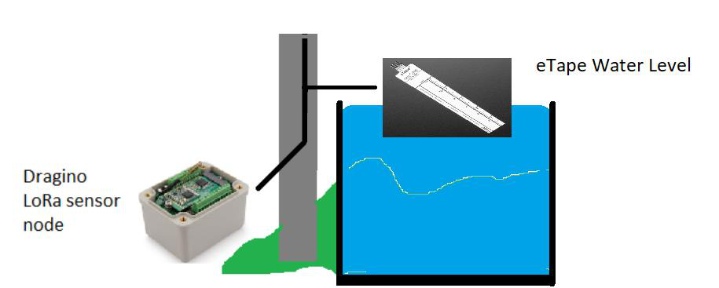{width="6.5in"
> height="2.611111111111111in"}

**Figure 1a:** Simplified diagram of the water level monitoring system.

11

> 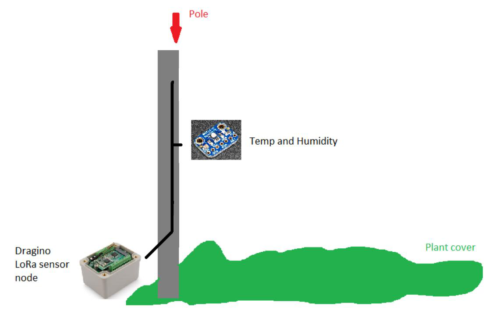{width="6.5in"
> height="4.1125in"}

**Figure 1b:** Simplified diagram of the temperature and humidity
monitoring system.

> 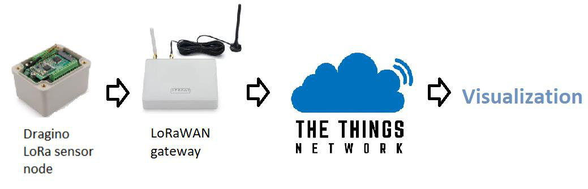{width="6.5in"
> height="2.0833333333333335in"}

**Figure 1c:** Data transfer diagram between LSN50 and TTN.

> **2.1 Hardware**
>
> The proposed system utilized various affordable hardware, including
> the following main components: the
>
> LSN50 sensor node, eTape water level sensor and SHT31 temperature and
> humidity sensor.
>
> 2.1.1 LSN50
>
> The LSN50 is a LoRaWAN sensor node developed for outdoor environment
> use and is able to maintain a

long-term battery life, while ensuring data transfer as an IoT solution.
The LSN50 is a main component in the

proposed system, as it will be connecting the sensors to TTN via the
LoRaWAN gateway. As shown in Figure 2a,

12

the LSN50 contains a miniature transmitter known as the LoRa ST module.
The LSN50 also contains a miniature

housing container for outdoor use. In addition, as shown in Figure 2b,
the LSN50 contains several pins and male

jumper wire connection ends. These different pins will be utilized in
the project and further discussed in the teaching

material. The LSN50 can also be turned on and off using a small jumper
provided by the LSN50 supplier. In

addition, as shown in Figure 2b, the reset button located on the top of
the LSN50 can be used to reset the sensor

> node manually.

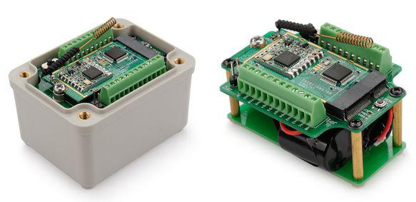{width="4.733332239720035in"
height="2.297222222222222in"}

**Figure 2a:** LSN50 sensor node.

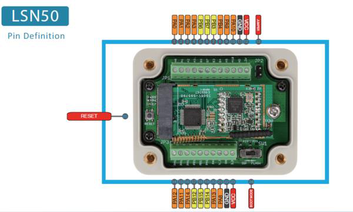{width="6.3027766841644794in"
height="3.7805555555555554in"}

**Figure 2b:** Pin definition of LSN50.

> 2.1.2 eTape water level sensor
>
> The eTape sensor is a fluid sensor used to measure various quantities
> of liquid including water, non-

corrosive water and dry fluids. When immersed in liquid, the eTape
sensor provides a corresponding resistance

13

value which is inversely proportional to the liquid level. As such, if
the resistance value increases, the liquid level

decreases. The 5 eTape sensor is supplied in different sides, and the 5
inch eTape sensor can be seen in Figure 3a,

in addition to the 4 pins of the eTape sensor in Figure 3b. In addition,
as mentioned, the resistance output of the

> eTape sensor is inversely proportional to the liquid level, thus this
> plot can be seen in Figure 3c.

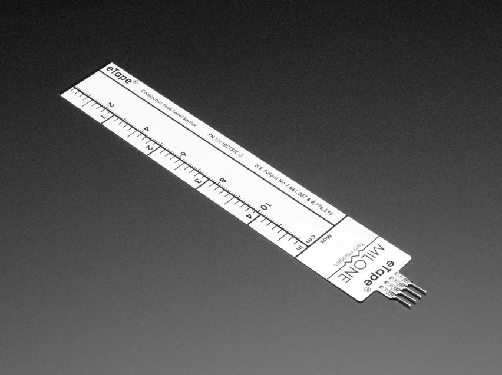{width="4.2611100174978125in"
height="3.188888888888889in"}

**Figure 3a:** 5 inch eTape sensor.

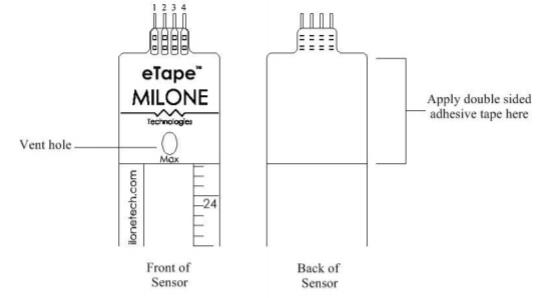{width="5.791666666666667in"
height="3.1041666666666665in"}

**Figure 3b:** Pin definition of eTape sensor\*

> *\*https://cdn.sparkfun.com/datasheets/Sensors/ForceFlex/eTape%20Datasheet%2012110215TC-8_040213.pdf*

14

> 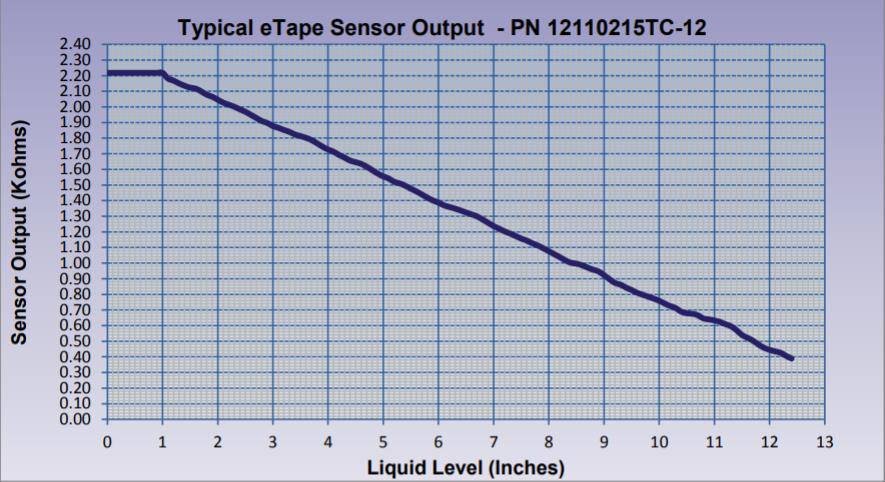{width="6.5in"
> height="3.5416666666666665in"}

**Figure 3c:** eTape sensor\'s resistance output vs liquid level plot.

> 2.1.3 SHT31 temperature and humidity sensor\
> **2.2 Software**
>
> The most used software for this project was Go SDK, found in TTN to
> implement the eTape and SHT31

sensors\' decoder functions. Go SDK; Cayenne My Devices will be used as
a visual visualization software to display

> the data visually.
>
> 2.2.1 The Things Network
>
> The Things Network (TTN) is a global community and an open-source IoT
> cloud service utilizing

LoRaWAN. TTN will be used in this project to receive the sensor data by
using an appropriate LoRaWAN gateway.

TTN also contains the Go SDK, which will be used to implement the
decoder functions for the sensors. Sample and

default payload decoder functions used as a reference for the sensors
can be found at

> **3. LSN50 connection to The Things Network**
>
> The LSN50 can be directly connected to TTN using keys provided by the
> supplier, Dragino. These keys

can be found in the package and used to set up the LSN50 in TTN. To
utilize the sensors, this project requires the

use of a LoRaWAN gateway to receive data from the LSN50 and send the
data to TTN. Similar to the LSN50, a

> gateway can also be set up in TTN.

15

> **3.1 LSN50 keys**
>
> To configure and connect the LSN50 to TTN, OTAA keys provided by
> Dragino will be used. The keys

used to configure the LSN50 are the DEV ADDR, DEV EUI, APP EUI and APP
KEY, as provided in the package.

The overall process of the LSN50 configuration can be found in the
following video link:

> **3.2 Gateway**
>
> LoRaWAN gateways are essentially intermediary connections between the
> sensors and TTN, which utilize

LoRaWAN. As shown in Figure 4, a gateway was used for this project to
deliver data from the LSN50 to TTN. In

Figure 4, it can also be seen that the gateway contains an antenna,
which is known as the RAK Outdoor antenna.

The specific gateway model used for the project is The Things Outdoor
Gateway. The gateway shown in Figure 4

> was also set up in TTN.

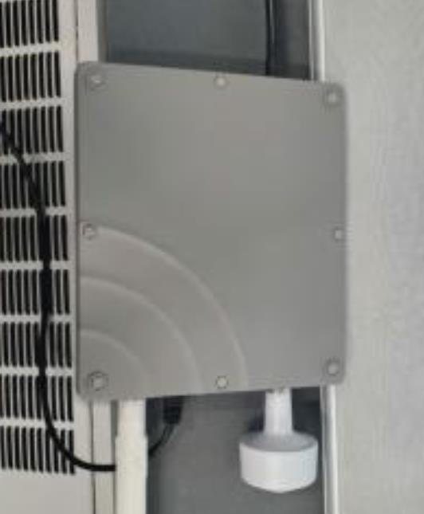{width="4.072222222222222in"
height="3.359721128608924in"}

**Figure 4:** The Things Outdoor Gateway.

> **4. eTape connection to LSN50**
>
> The connection between the eTape and the LSN50 consists of using a
> voltage/resistance divider circuit

between the eTape and the LSN50, as shown in Figure 5a. Corrected
resistance outputs can be measured using the

eTape. In addition to the wiring between the eTape and the LSN50,
appropriate housing was used to protect the

eTape from outside weather conditions. After appropriate wiring of the
voltage/resistance divider circuit could be

> implemented, calibration of the eTape and measurement of different
> water levels took place.

16

> 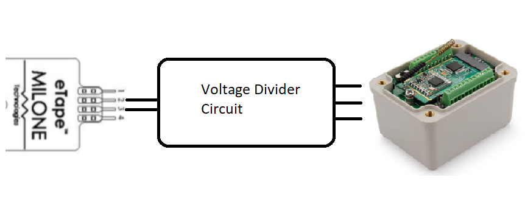{width="6.066666666666666in"
> height="2.3819444444444446in"}

**Figure 5a:** Connection between the eTape sensor and the LSN50.

> **4.1 Hardware**
>
> The connection between the eTape sensor and the LSN50 required the
> voltage/resistance divider circuit\'s

wiring on a breadboard. Besides, as mentioned, an appropriate protective
housing would be needed for the eTape

> sensor.
>
> 4.1.1 Breadboard wiring
>
> The breadboard wiring between the eTape and the LSN50 consisted of a
> voltage/resistance divider circuit.

The voltage/resistance divider circuit can be seen in Figure 5b, which
utilizes the two pins on the eTape, pin 2 and

3\. Pins 2 and 3 of the eTape are responsible for delivering the water
level data of the eTape. As shown in Figure

5b, pin 2 of the eTape is connected to the VDD of the LSN50. To create a
voltage divider circuit between the eTape

and the LSN50, a resistor is connected between pin 3 of the eTape and
GND of the LSN50. This resistor can be in

the range of 0 Ohms to 2000 Ohms. However, the resistance must be taken
into account in the TTN payload decoder

code. These electrical parameters will be addressed in future sections
regarding the software used for the eTape.

Pin 3 of the eTape is also connected to pin PA0 of the LSN50, which
delivers the analog input information in volts.

17

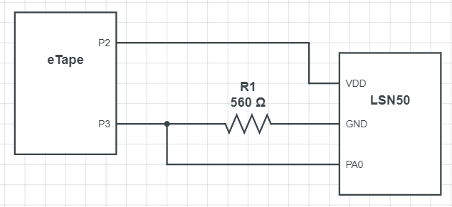{width="5.354166666666667in"
height="2.4541666666666666in"}

**Figure 5b:** Voltage divider circuit of eTape.

> 4.1.2 eTape housing setup
>
> As mentioned previously, the eTape requires a protective housing
> setup. The housing of the eTape includes

polycarbonate tubing protecting the eTape, in addition to a housing cap
to protect the pins of the eTape, as shown

in Figure 5c. The jumper wires extending from the eTape to the
breadboard will require shielding and cover. Also,

the breadboard will require a housing case, similar to the LSN50. A
simple diagram of the housing setup is provided

> in Figure 5c. An additional diagram of the housing in the stormwater
> drainage area can be seen in Figure 5d.
>
> 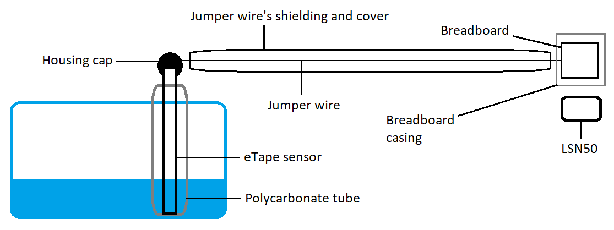{width="6.5in"
> height="2.4305555555555554in"}

**Figure 5c:** eTape housing setup.

18

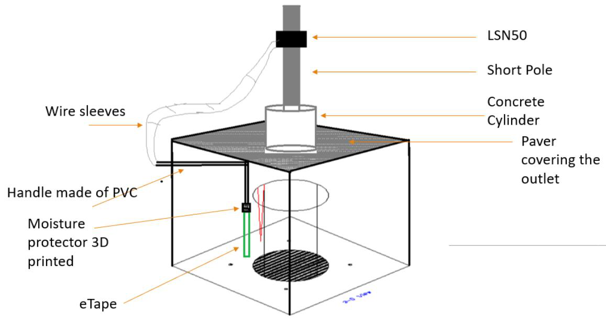{width="7.0in"
height="3.8472222222222223in"}

**Figure 5d:** eTape housing setup inside the stormwater drainage area.

> **4.2 Software**
>
> The software utilized for this project involved TTN. In using TTN, the
> calibration of the eTape sensor took

place. After adjusting the eTape sensor according to the calibration,
measurements of the water level were recorded

at various levels. In addition, the percent errors of the water levels
were calculated. The code used for the eTape

> sensor can be found in the appendix in section 9.
>
> 4.2.1 Programming of eTape
>
> The overall programming process of the eTape consisted of the
> following procedure:
>
> 1.Assuming the LSN50 sensor node is already registered to TTN with the
> supplier\'s keys, the programming
>
> of the eTape can be done using a payload decoder.
>
> 2.First, the updated version of the reference payload decoder function
> code found in
>
> can be used. As the eTape will operate in the first mode condition, wh
>
> lay the analog input voltage, PA0. Thus, the code in this mode
> condition will be changed,
>
> and additional code will be added to allow the payload decoder to
> display the information on the water
>
> levels in inches and cm. First, as shown in Figure 6a, variable
> declarations and initializations in lines 5
>
> through 8 are stated. The reference level will be equal to 0, as the
> eTape is measuring from 0 inches or 0

19

> cm\. The resistance, R, will be 560 Ohms, as stated. The initial
> voltage will be calibrated as will be set in
>
> the next few steps, but for now, it can be a value in the expected
> range of 1.01 to 1.03. Additionally, the
>
> calibration variable, which is a constant, is set to 1500. This
> arbitrary constant is found from multiple
>
> Arduino-based projects that use this value as the constant to convert
> from voltage to water level.
>
> 3.Additional code implementation can be added to the payload decoder,
> as found in Figure 6b. Lines 12 and
>
> 13 can remain the same, as these will not be used in the water level
> calculations for the eTape. Line 15 will
>
> essentially be the updated reference level in inch, using the
> calibration, resistance and initial voltage value.
>
> It is seen in line 15 that the 3.3 constant corresponds to the battery
> voltage of the LSN50, which is
>
> approximately 3.3 V. The value of the analog input voltage can then be
> found from line 17, where the byte
>
> places of 4 and 5 are used to assign the analog input voltage value to
> the variable v. The variable v can then
>
> be decoded in line 18 as shown. Thus far, only the reference level in
> inch and analog input voltage has been
>
> obtained, and it will be necessary to compute the actual water level
> measurement in both lines 19 and 20.
>
> In line 19, as same as before, with calculating the reference level in
> line 15, the calibration, resistance and
>
> the measured analog input voltage value will be used. In addition, the
> reference level and 1 inch will be
>
> subtracted from line 19 as the measured water level is about some
> reference level. The water level in inches
>
> is then decoded in line 19. Using the same equation from line 19, line
> 20 will decode the water level in cm.
>
> Thus the equation from line 19 is multiplied by 2.54. These changes
> will allow the eTape to display some
>
> value for the analog input and water level in inches and cm. However,
> it still is required to calibrate the
>
> eTape according to the environmental conditions as the analog input
> voltage changes from different
>
> locations. This is due to the temperature being a factor in the analog
> input voltage. Thus, different
>
> environments will have different analog input voltages.
>
> 4.After all the necessary code has been implemented for the payload
> decoder function, the analog input
>
> voltage of the eTape sensor can now be calibrated. First, the
> container with the eTape will need to be at 0
>
> inches or 0 cm to measure and change the initial voltage value found
> in line 7 of Figure 6a. Afterwards,
>
> send a manual uplink from the LSN50 to TTN by pressing the reset push
> button located on the top of the
>
> LSN50. A data packet will then be sent to TTN, as shown in Figure 6c.
> The analog input voltage value
>
> found in TTN is 1.011 from ADC_CH0V. This value correlates to the
> measured analog input voltage value.
>
> Press the push button on the LSN50 again and record all the analog
> input voltage values displayed. After
>
> about 15 to 20 button clicks, take the average of all the analog input
> voltage values, and update this value
>
> to line 7 of Figure 6a, such that the \"var initial_voltage = 1.015\"
> in line 7 of Figure 6a will be changed to
>
> the average of the analog input voltage values. For instance, if the
> average of the analog input voltage values
>
> is 1.02, this will be updated to line 7, as shown in Figure 6d. After
> this calibration step, the eTape can now
>
> be used to measure water levels with great accuracy.

20

> 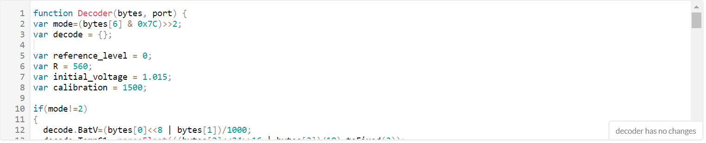{width="6.566665573053369in"
> height="1.3347222222222221in"}
>
> **Figure 6a:** eTape payload decoder function variable declarations
> and initializations.
>
> 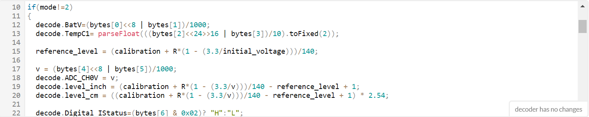{width="6.575in"
> height="1.3208333333333333in"}
>
> **Figure 6b:** eTape payload decoder function code implementation to
> displaying water levels.
>
> 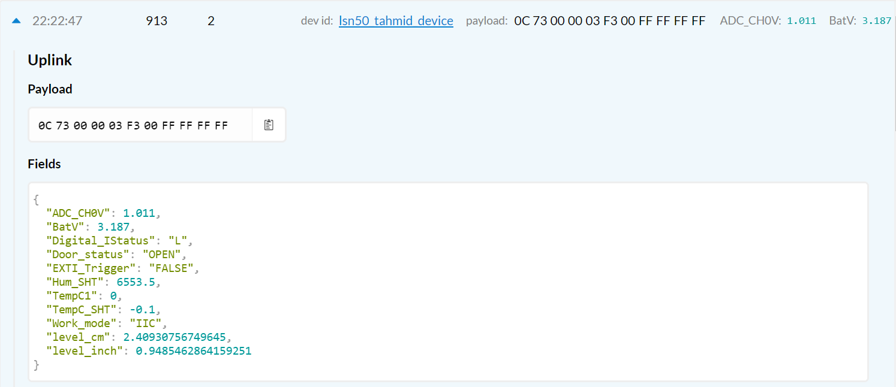{width="6.597222222222222in"
> height="2.8569444444444443in"}

**Figure 6c:** Display of analog input voltage value.

> 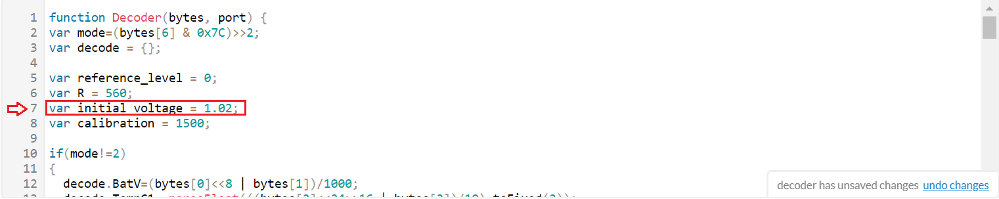{width="6.638888888888889in"
> height="1.3138888888888889in"}

Figure 6d: Updated analog input voltage value in line 7.

> 4.2.3 Measurement of water levels

After several test trials of the water level throughout the calibration
process, the following results are produced for

> different water levels, as shown in Table 4.

21

**Table 4:** Results of the eTape readings at different water levels.

+---------------------+---------------------+-----------------+
| > Actual Value (cm) | > Sensor Value (cm) | > Percent Error |
+=====================+=====================+=================+
| > 2.4 cm            | > 2.16 cm\          | > 10%\          |
|                     | > 2.19 cm\          | > 8.75%\        |
|                     | > 2.19 cm\          | > 8.75%\        |
|                     | > 2.19 cm\          | > 8.75%\        |
|                     | > 2.16 cm           | > 10%           |
+---------------------+---------------------+-----------------+
| > 2.9 cm            | > 2.77 cm\          | > 4.48%\        |
|                     | > 2.77 cm\          | > 4.48%\        |
|                     | > 2.80 cm\          | > 3.45%\        |
|                     | > 2.77 cm\          | > 4.48%\        |
|                     | > 2.80 cm           | > 3.45%         |
+---------------------+---------------------+-----------------+
| > 4 cm              | > 3.84 cm\          | > 4%\           |
|                     | > 3.92 cm\          | > 2%\           |
|                     | > 3.84 cm\          | > 4%\           |
|                     | > 3.84 cm\          | > 4%\           |
|                     | > 3.82 cm           | > 4.5%          |
+---------------------+---------------------+-----------------+
| > 5.1 cm            | > 5.22 cm\          | > 2.35%\        |
|                     | > 5.14 cm\          | > 0.78%\        |
|                     | > 5.14 cm\          | > 0.78%\        |
|                     | > 5.14 cm\          | > 0.78%\        |
|                     | > 5.14 cm           | > 0.78%         |
+---------------------+---------------------+-----------------+
| > 6 cm              | > 6.08 cm\          | > 1.33%\        |
|                     | > 6.13 cm\          | > 2.17%\        |
|                     | > 6.08 cm           | > 1.33%         |
+---------------------+---------------------+-----------------+

22

+--------+------------+-----------+
|        | > 6.06 cm\ | > 1%\     |
|        | > 6.08 cm  | > 1.33%   |
+========+============+===========+
| > 7 cm | > 6.98 cm\ | > 0.29%\  |
|        | > 6.96 cm\ | > 0.57%\  |
|        | > 6.85 cm\ | > 2.14%\  |
|        | > 6.96 cm\ | > 0.57%\  |
|        | > 6.98 cm  | > 0.29%   |
+--------+------------+-----------+
| > 8 cm | > 8.03 cm\ | > 0.38%\  |
|        | > 7.99 cm\ | > 0.13%\  |
|        | > 7.95 cm\ | > 0.71%\  |
|        | > 7.91 cm\ | > 1.125%\ |
|        | > 7.95 cm  | > 0.63%   |
+--------+------------+-----------+

> **5. SHT31 connection to LSN50**
>
> The SHT31 sensor is one of the most accurate temperatures and humidity
> sensors, requiring minimal space and

wire connections. As shown in Figure 7a, the sensor contains six pins,
where the pins used in this project include:

> VIN, GND, SDA and SCL. The specific detailed information of the SHT31
> sensor can be found in the datasheet:
>
> The connection between the SHT31 sensor and the LSN50 is very similar
> to that of the
>
> no calibration or voltage/resistance divider circuits being used in
> the setup. To establish
>
> the connection for the SHT31 sensor, first, the pins of the SHT31
> sensor need to be connected to their respective

LSN50 pins. Afterwards, a simplified payload function code displaying
the humidity and temperature will need to

> be used.

23

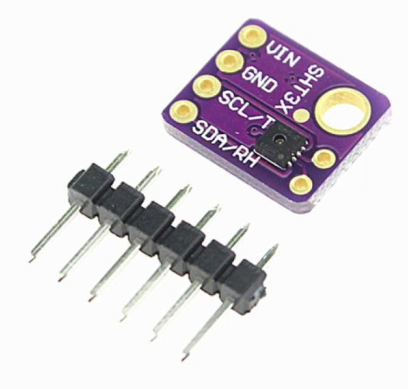{width="3.4833333333333334in"
height="3.316666666666667in"}

**Figure 7a:** SHT31 sensor with pin headers.

> **5.1 Hardware**
>
> The hardware connection between the SHT31 sensor and the LSN50 is
> similar to that of the eTape, with no
>
> voltage/resistance divider required. Initially, the pins of the SHT31
> sensor were soldered such that they allowed
>
> the connection of jumper wires.
>
> 5.1.1 Wiring
>
> The wiring between the SHT31 sensor and the LSN50 is shown in Figure
> 7b as follows:
>
> ●The VIN pin from the SHT31 sensor is connected to the VDD pin of the
> LSN50.
>
> ●The GND pin from the SHT31 sensor is connected to the GND pin of the
> LSN50.
>
> ●The SDA pin from the SHT31 sensor is connected to the PB7 pin of the
> LSN50.
>
> ●The SCL pin from the SHT31 sensor is connected to the PB6 pin of the
> LSN50.

24

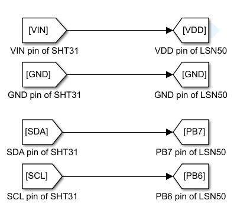{width="3.473611111111111in"
height="3.2305555555555556in"}

**Figure 7b:** Wiring between the SHT31 sensor and the LSN50.

> **5.2 Software**
>
> As before, TTN is used to code the payload function. The reference
> payload function code found in

was used, similar to that of the eTape. Using the SHT31 sensor, it was
found

easure the humidity and temperature. In addition, any mode other than 2
was

used for calculating the battery value. This is shown in Figure 7c,
where modes 2 and 0 are used to decode the

humidity and temperature. In addition, the reference payload function
code was also modified to display two values

for the temperature, one in Celsius and the other in Kelvin, where tempC
is in Celsius and tempK is in Kelvin. As

opposed to the eTape sensor, the software component of the SHT31 sensor
required no calibration. The code used

> for the SHT31 sensor can be found in the appendix in section 9.
>
> 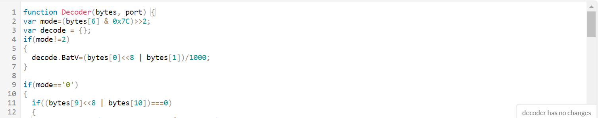{width="6.5in"
> height="1.2916666666666667in"}
>
> 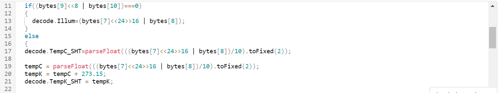{width="6.5in"
> height="1.2222222222222223in"}

25

> 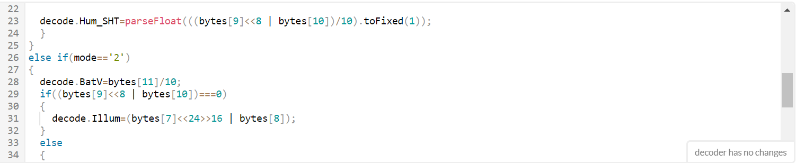{width="6.5in"
> height="1.3333333333333333in"}
>
> 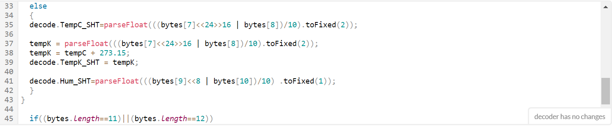{width="6.5in"
> height="1.3472222222222223in"}
>
> 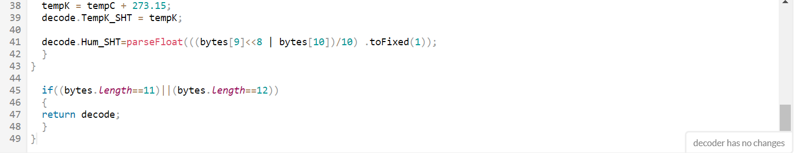{width="6.5in"
> height="1.25in"}

**Figure 7c:** Decoder function code for the SHT31 sensor.

> 5.2.1 Measurement of temperature and humidity
>
> Once the decoder function has been implemented for the SHT31 sensor,
> the SHT31 sensor was used to measure
>
> the humidity and temperature, as shown in Figure 7d. It was found that
> the values displayed do indeed reflect the
>
> actual room temperature and humidity, as found from the thermostat and
> the location\'s humidity value.

26

> 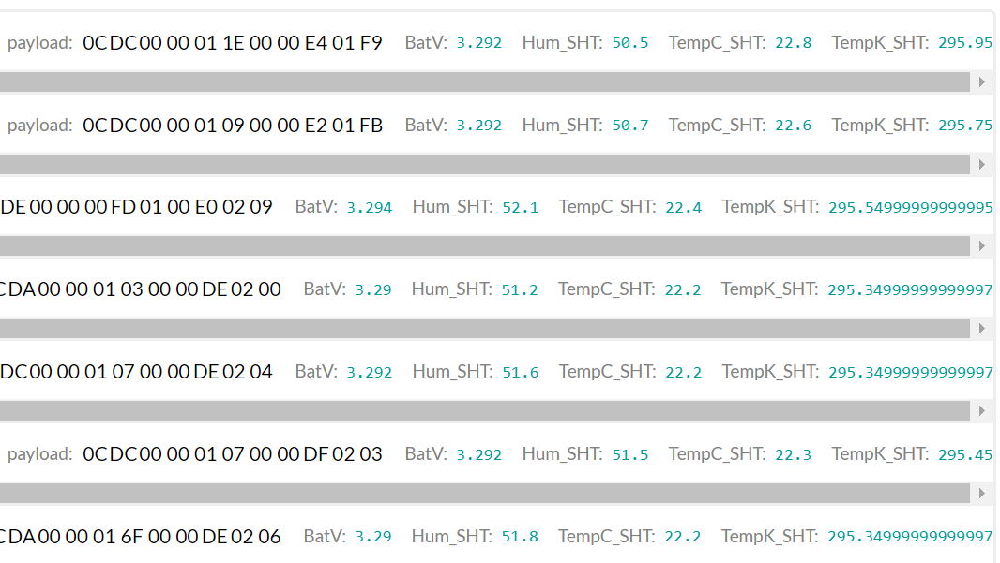{width="6.5in"
> height="3.6666666666666665in"}

**Figure 7d:** Measurement of humidity and temperature using the SHT31
sensor.

> **6. Visualization platform of LSN50**\
> The visualization of the data for both the eTape and SHT31 sensors was
> done using Cayenne My Devices. The
>
> visualization can be done by following the listed steps:
>
> 1.Create an account on Cayenne My Devices:
>
> 2.Select to add a device and add the LSN50 dided by the supplier.
>
> 3.Send an uplink using the LSN50 device.
>
> 4.After the uplink from the LSN50 device is sent and registered by
> Cayenne My Devices, the visualization
>
> will display in the dashboard.
>
> In addition to the overall visualization, the data obtained from the
> visualization can be downloaded for external
>
> use.
>
> **6.1 Visualization of eTape sensor water levels**
>
> The eTape sensor data visualization can be obtained from Cayenne My
> Devices by first registering the

device or the LSN50 in this case. The documentation in registering the
device on Cayenne My Devices can be found

in The widgets in Cayenne can show the sensor data similar to Figures

8at sensor data, and Figure 8b contains the RSSI, SNR and battery value

data. As shown in Figure 8c, the values for the analog input can be
displayed in a graph over a period of time less

27

than 1 month, as Cayenne can store data for a month. These analog input
values can then be downloaded from

Cayenne and imported into Microsoft Excel to be used to calculate the
water levels in inches and cm. The process

for downloading the sensor data from Cayenne will be discussed more
thoroughly in the future sections

downloading process. However, for now, assuming the sensor data has been
downloaded and imported to Excel as

shown in Figure 8d, Excel supports both .txt and .csv file formats for
the sensor data. Thus, the sensor data file\'s

extension after it is downloaded can be changed as such and imported
into Excel. The imported data will look like

as follows in Figure 8e, which contains various columns such as the
timestamp, sensor ID, channel, sensor name,

values produced etc. To find the water level in cm from the analog input
values found in Figure 8e, the equation in

column I2 of Figure 8e can be used. A similar equation can display the
water level in inches from the analog input

values by removing the 2.54 multiplication. The water levels in cm can
then be seen in Figure 8f, which contains

> an additional column using the equation to convert from analog input
> voltage to water level in cm.

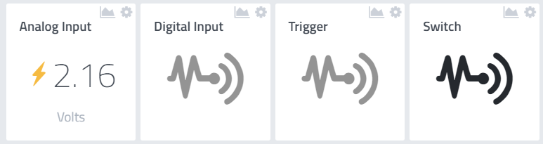{width="6.3069444444444445in"
height="1.6805555555555556in"}

**Figure 8a:** Analog input value displayed on Cayenne My Devices.

28

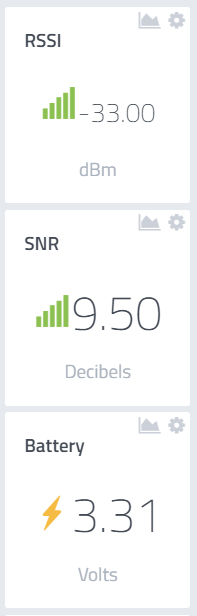{width="1.6666666666666667in"
height="5.211111111111111in"}

**Figure 8b:** RSSI, SNR and battery value displayed on Cayenne My
Devices.

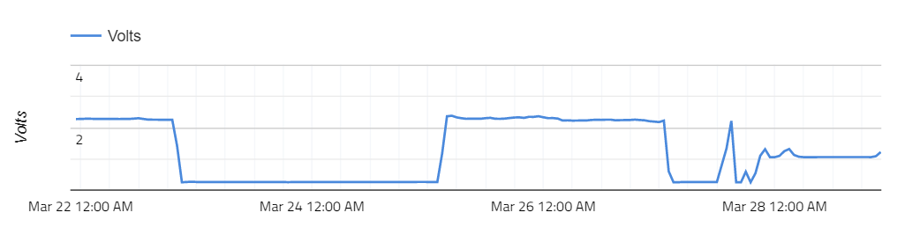{width="7.0in"
height="1.8749989063867016in"}

**Figure 8c:** Analog input voltage graph displayed on Cayenne My
Devices.

29

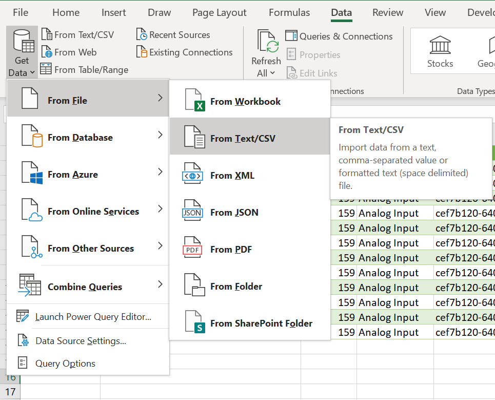{width="5.5569444444444445in"
height="4.490277777777778in"}

**Figure 8d:** Importing of eTape sensor data file in .txt or .csv
format in Excel.

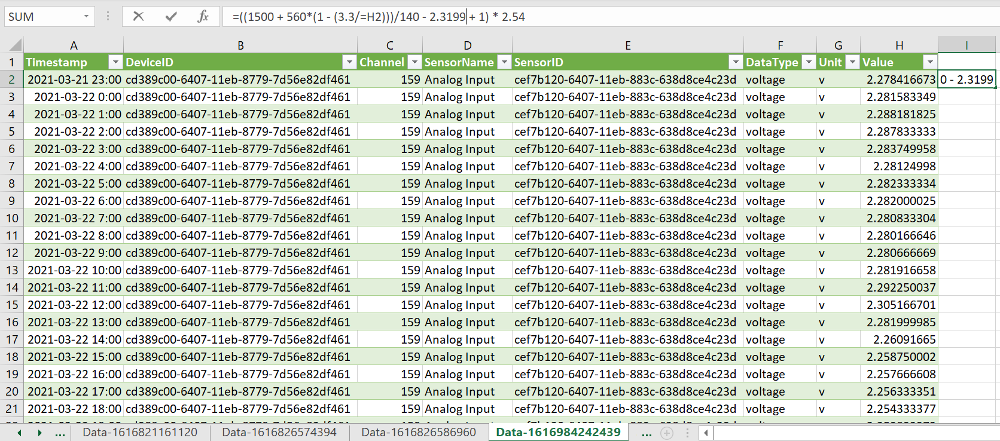{width="7.0in"
height="3.083332239720035in"}

**Figure 8e:** Imported eTape sensor data in Excel.

30

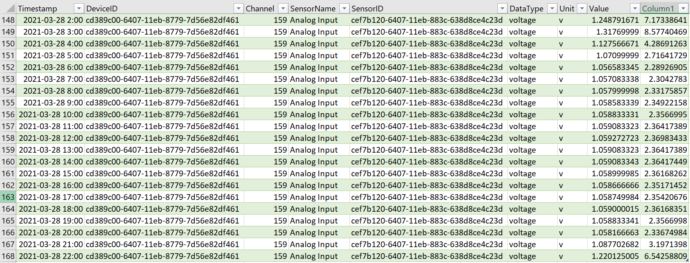{width="7.0in"
height="2.6805555555555554in"}

**Figure 8f:** Display water level in cm from analog input voltage
conversion to the water level in Excel.

> **6.2 Visualization of SHT31 sensor temperature and humidity**
>
> The visualization of the SHT31 sensor can be seen in Figure 9a, which
> displays the analog input in Volts,

temperature in Celsius or Kelvin and the humidity in percent. To obtain
the data from Cayenne My Devices, an

uplink will need to be sent and registered. Additionally, the received
signal strength indicator (RSSI) in dBm, signal-

to-noise ratio (SNR) in Decibels and battery value in Volts can be seen
in Figure 9b. The overall live data can be

seen in Figure 9c, which produces the graphs of Figure 9d, 9e and 9f.
Figure 9d and 9e displays the temperature

obtained from the SHT31 sensor in Celsius and Kelvin respectively.
Figure 9f displays the humidity obtained in

percent. Similar to the eTape sensor data, the SHT31 sensor data can be
downloaded from Cayenne as well. The

downloading process will be discussed more thoroughly in the next
section. Assuming the SHT31 sensor data has

been downloaded, it can be imported as seen in Figures 9g and 9h,
containing the temperature and humidity sensor

> data, respectively.
>
> {width="6.5in"
> height="1.3333333333333333in"}

**Figure 9a:** Obtained data from the SHT31 sensor.

31

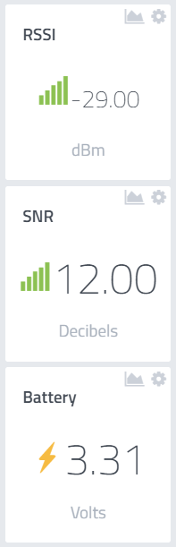{width="1.5027777777777778in"
height="4.661111111111111in"}

**Figure 9b:** Obtained data from the SHT31 sensor.

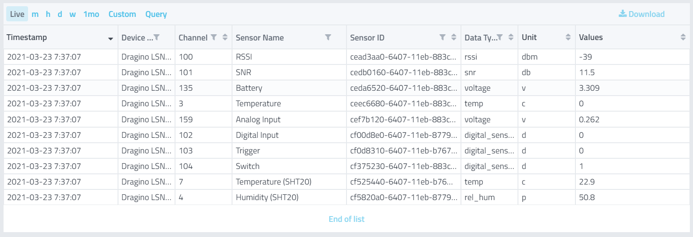{width="6.5in"
height="2.2222222222222223in"}

**Figure 9c:** Live data obtained from the SHT31 sensor.

32

> 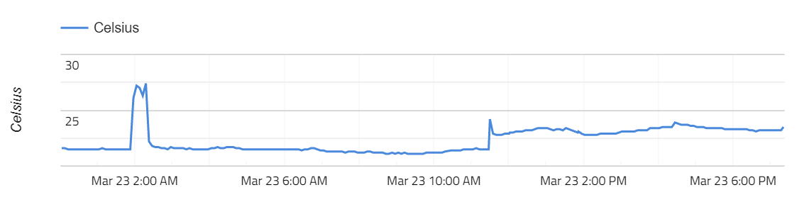{width="6.5in"
> height="1.8055555555555556in"}

**Figure 9d:** Temperature data in Celsius obtained from the SHT31
sensor.

> 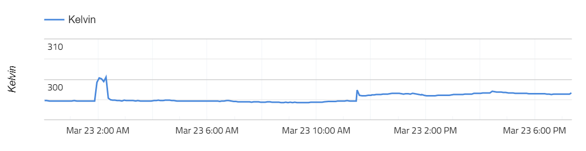{width="6.5in"
> height="1.6805555555555556in"}

**Figure 9e:** Temperature data in Kelvin obtained from the SHT31
sensor.

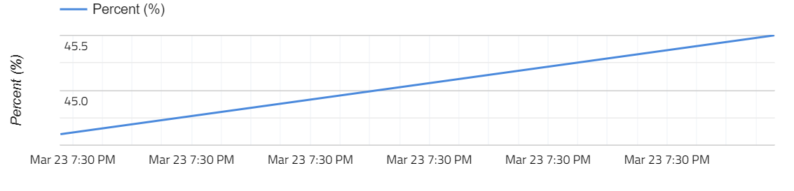{width="6.5in"
height="1.5694444444444444in"}

**Figure 9f:** Humidity data in percent obtained from the SHT31 sensor.

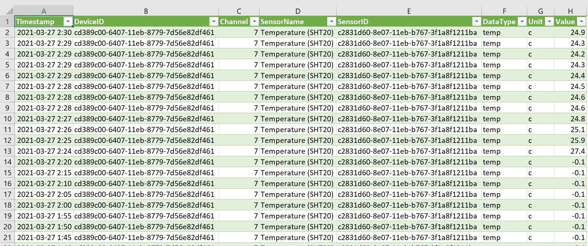{width="7.0in"
height="2.9305555555555554in"}

**Figure 9g:** Imported SHT31 temperature values in Excel.

33

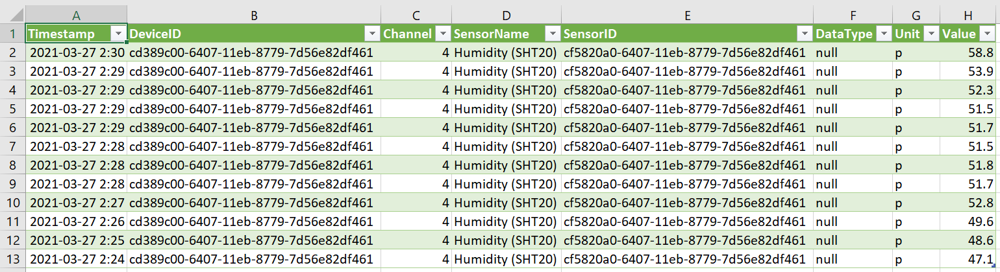{width="7.0in"
height="1.9027777777777777in"}

**Figure 9h:** Imported SHT31 humidity values in Excel.

> **6.3 Downloading of sensor data**\
> Downloading the sensor data from Cayenne My Devices and importing it
> into Excel is a relatively simple process.
>
> Sensor data can be downloaded and imported as follows:
>
> 1.First, click on the graph option in the widget to obtain data in a
> custom time range. The custom time range
>
> can be any range within a month. The time range could also be selected
> as the last minute, hour, day, week
>
> or month. In Figure 10a, the graph is selected to display values
> within the past hour.
>
> 2.Click on \"Download Chart Data\" below the graph as found in Figure
> 10a. In addition to downloading the
>
> graph\'s data, it can also be downloaded from the \"Data\" section of
> the visualization dashboard. The
>
> download button in this section on the top right can also be selected,
> as shown in Figure 10b.
>
> 3.After the sensor data has been downloaded, it can be found as just a
> regular file with no extensions. An
>
> extension may be added such as .txt or .csv shown in Figure 10c and
> 10d respectively by renaming the file
>
> name to contain the .txt or .csv extension. The contents of the .txt
> extension can be seen in Figure 10e,
>
> which contains the SNR values of the sensor data. The contents of the
> .csv extension can be seen in Figure
>
> 10f, which can be directly opened with Excel.
>
> 4.Adding the extension .txt to the file name will allow it to be
> imported into Excel, similar to the .csv
>
> extension. From the \"Data\" tab in Excel, the sensor data in .txt
> format can be imported as follows in Figure
>
> 10g.
>
> 5.The results of the imported .txt formatted sensor data can be seen
> in Figure 10h. Using the data in Excel,
>
> research can be done to find meaningful insights into the data.

34

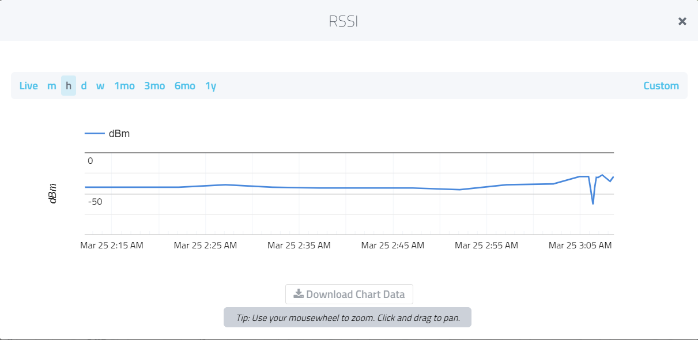{width="7.0in"
height="3.4166666666666665in"}

**Figure 10a:** Graph of the RSSI sensor data.

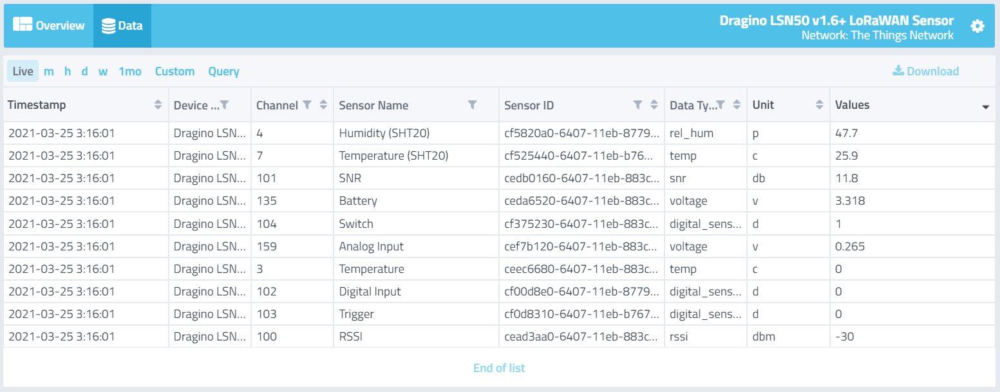{width="7.0in"
height="2.75in"}

**Figure 10b:** Live sensor data.

{width="2.7333333333333334in"
height="0.7277766841644795in"}

**Figure 10c:** Downloaded sensor data with .txt extension added by
renaming.

{width="2.720833333333333in"
height="0.34305555555555556in"}

**Figure 10d:** Downloaded sensor data with .csv extension added by
renaming.

35

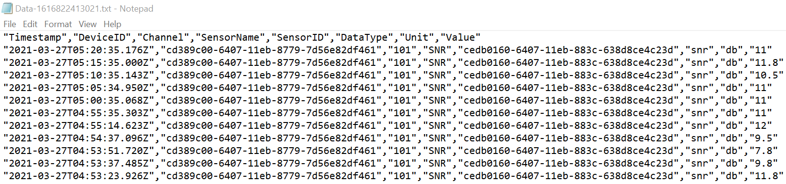{width="7.0in"
height="1.6388888888888888in"}

**Figure 10e:** Downloaded sensor data in .txt format.

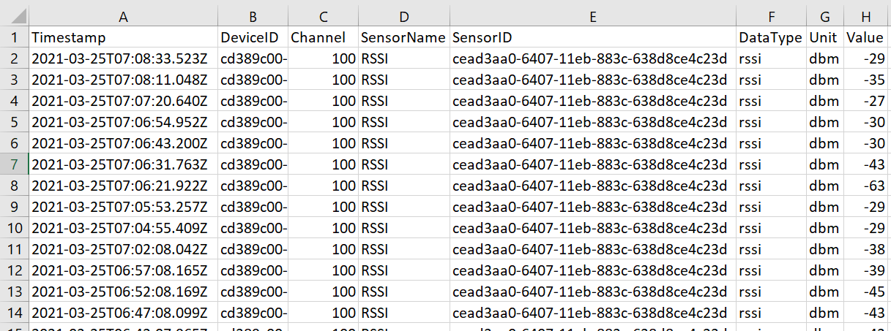{width="7.0in"
height="2.611111111111111in"}

**Figure 10f:** Downloaded sensor data in .csv format, directly opened
with Excel without imports.

36

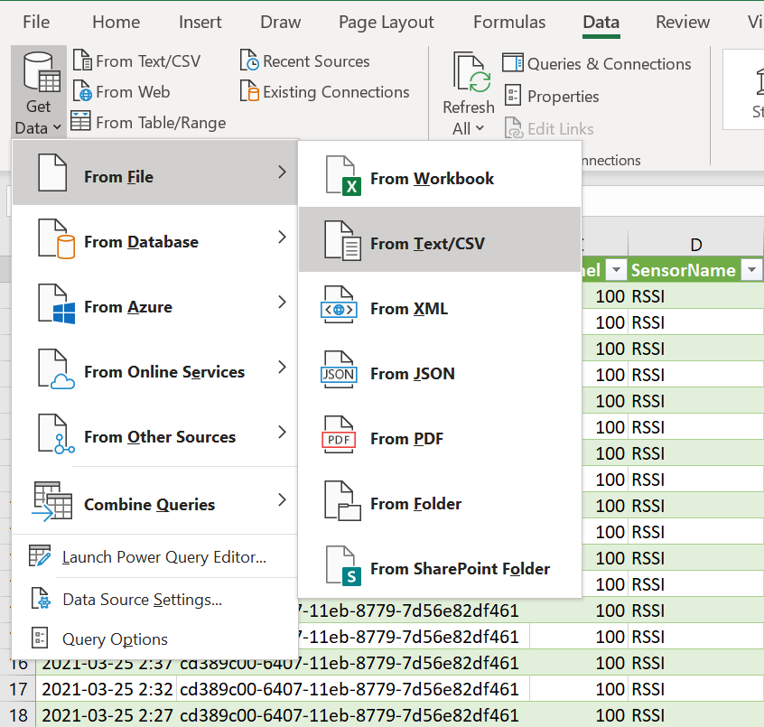{width="5.274998906386702in"
height="5.027777777777778in"}

**Figure 10g:** Importing sensor data in .txt or .csv format in Excel.

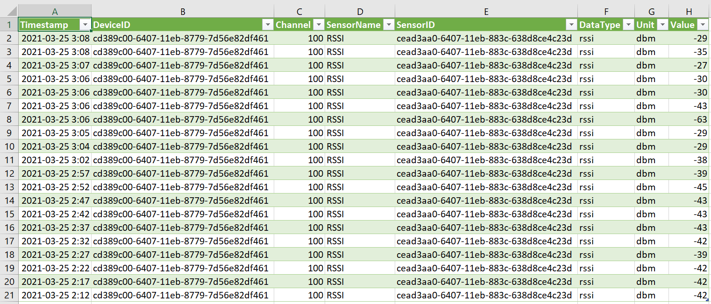{width="7.0in"
height="3.0in"}

**Figure 10h:** Imported sensor data in Excel.

37

> **6.4 Sensor data storage**
>
> Cayenne My Devices itself do the sensor data storage, and the stored
> data can last for a month. Thus, the
>
> maximum storage capacity of Cayenne is a month. Currently, Cayenne
> does not provide any options or
>
> adjustment choices of the storing capability or settings. However,
> once the data is stored, it will last for a month
>
> and can be downloaded anytime within the month.
>
> **7. Parameter measurements**
>
> Both the values of RSSI and SNR have been measured in the IoT sensors.
> As the system uses an antenna
>
> from a gateway, there will likely be signal loss from noise or any
> other attenuation present. Thus, the parameters

of RSSI (Received signal strength indicator) and SNR (Signal-to-noise
ratio) are essential for IoT systems such as

> this project. As such, these two parameters will be further focussed
> on in this section.
>
> **7.1 Received signal strength indicator**
>
> RSSI or received Signal Strength Indicator measurements are
> essentially a representation of the quality of
>
> the signal with respect to any noise or possible attenuation loss from
> a device\'s antenna or transmitter. A higher
>
> RSSI value indicates a stronger signal and less noise caused by any
> signal losses. Likewise, a lower RSSI value
>
> indicates a weaker signal and more pronounced noise caused by signal
> losses. RSSI can be expressed in various
>
> units. However, a common unit is decibel milliwatts, or dBm. As the
> decibel units are based on a logarithmic
>
> scale, RSSI is expressed as a negative value.
>
> Usually, a -50 dBm RSSI value indicates a very strong signal with
> minimal noise or any signal loss, while

an RSSI below -80 dBm indicates a weak signal. However, this value can
change with distance, as seen in Figure

> 11a, where the RSSI decreases as the distance of the transmitted
> signal increases. The RSSI values found in the

graph of Figure 11b and the values in Excel of Figure 11c show that the
RSSI rarely drops below -50 dBm, which

indicates a robust signal from the antenna or transmitter. However, this
value can also be improved by decreasing

> the distance the transmitted signal has to travel. Different RSSI
> tests could also be performed to find an
>
> appropriate placement of the device that produces desired RSSI values.
>
> *(https://www.researchgate.net/figure/Distance-vs-RSSI-Curve-Fit-by-Plotting-Various-Points_fig1_322877438)*

38

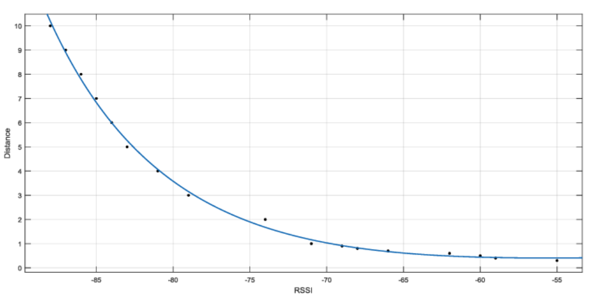{width="6.088888888888889in"
height="3.1069444444444443in"}

**Figure 11a:** RSSI vs distance of the transmitted signal.

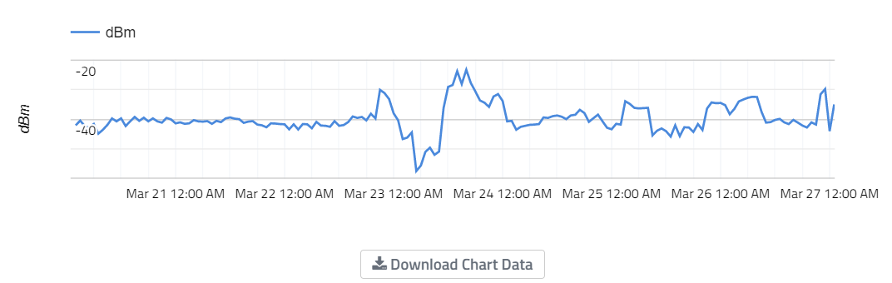{width="7.0in"
height="2.2222222222222223in"}

**Figure 11b:** Graph of RSSI values in Cayenne My Devices.

{width="7.0in"
height="2.986111111111111in"}

**Figure 11c:** Imported values of RSSI in Excel.

39

> **7.2 Signal-to-noise ratio**
>
> The SNR or signal-to-noise ratio is the measured ratio between the
> signal power and the noise-based signal\'s

power. Thus, it is essentially the ratio between the desired signal and
the undesired signal. A higher value for the

SNR indicates a strong desired signal power and low undesired signal
power. In comparison, a lower value for the

SNR indicates a lower desired signal power and higher undesired signal
power. The SNR units are usually dB, thus

as the units are in a logarithmic scale, the actual ratio value of 1
corresponds to 0 dB, where a 0 dB value indicates

> the desired signal\'s power is equal to the undesired signal\'s power.
>
> The measurement of SNR becomes very important in IoT systems where
> performance and signal loss due

to noise is a factor. As IoT systems revolve around data transfer from
transmitters and antennas, the values of the

SNR must remain higher than a certain threshold. The graph of the SNR
can be seen in Figure 11d and the values

in Excel in Figure 11e. Generally, an SNR in the range of 10 to 15 dB is
necessary to establish an accepted

> connection. However, connections that require multiple WiFi access
> points in a network will require a higher SNR.
> *(https://www.netspotapp.com/help/what-is-the-signal-to-noise/)*

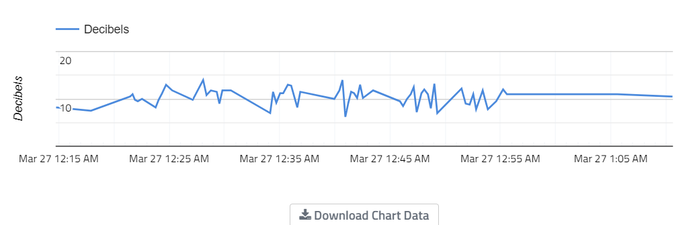{width="7.0in"
height="2.2777777777777777in"}

**Figure 11d:** Graph of SNR values in Cayenne My Devices.

40

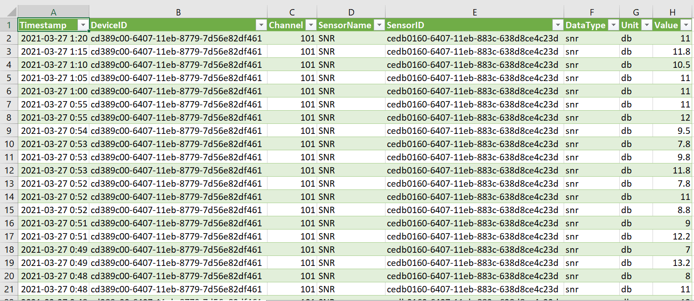{width="7.0in"
height="3.0416666666666665in"}

**Figure 11e:** Imported values of SNR in Excel.

> **8. Conclusion**
>
> In this project, an IoT system using the eTape water level and SHT31
> temperature and humidity sensors
>
> was built. The sensor node used for this project was the LSN50. This
> project focused on the development of the sensors, both in their
> hardware and software components. After building the sensors, the
> sensors\' visualization was completed to show meaningful patterns and
> insights of the sensor data. Furthermore, the parameters of RSSI and
> SNR were studied to determine conclusions about the quality of the
> sensor data.
>
> **8.1 Potential roadblocks and challenges**
>
> Potential roadblocks and challenges faced in this project included
> mainly the initial programming of the
>
> eTape sensors to allow it the LSN50 sensor node to obtain the ADC
> voltage values of the analog input pins. However, once this crucial
> step was completed and ADV voltage values were received in TTN using
> the payload decoder, the next important task became converting the ADC
> voltage value to the water level in inches and cm. After this task had
> been completed, in addition to the necessary calibration and payload
> decoder code modifications, accurate water level measurements were
> produced by the eTape. As such, this task required a trial and error
> procedure in code improvements, testing's and calibration. However,
> altogether these efforts produced accurate results for the eTape
> sensor.
>
> **8.2 Further recommendations**
>
> Further recommendations to continue this project may include obtaining
> other environmental parameters such as sunlight, precipitation, or
> oxygen levels to produce further environmental monitoring insights. In
> addition, other work with different sensor nodes other than the LSN50
> can also be implemented, such that they use LoRaWAN. Overall, this
> project may lead to various future projects in environmental
> monitoring.

41

> **9. Appendix**\
> The appendix provides any finalized programming codes used in this
> project from both the eTape and SHT31 sensors. The programming codes
> may be directly copied as text from this appendix.
>
> **9.1 Programming Code**\
> **9.1.1 eTape sensor payload decoder function code as used in this
> teaching material**

The following code is applicable for both the 12 inch and 5-inch eTape
sensors. It is used without any if-statements

and is the same code used in this teaching material. For the 12-inch
eTape, only the initial voltages may be different

> from the 5-inch eTape.
>
> function Decoder(bytes, port) {\
> **var** mode = (bytes\[6\] &0x7c) \>\>2;\
> **var** decode = {};\
> **var** reference_level = 0;\
> **var** R = 560;\
> **var** initial_voltage = 1.348;\
> **var** calibration = 1500;\
> **var** batttery_value = 3.3;\
> **if** (mode !=2) {\
> battery_value = ((bytes\[0\] \<\<8) \| bytes\[1\]) /1000;\
> decode.BatV = battery_value;\
> decode.TempC1 = parseFloat(\
> ((((bytes\[2\] \<\<24) \>\>16) \| bytes\[3\]) /10).toFixed(2)\
> );\
> reference_level =\
> (calibration + R \* (1- battery_value / initial_voltage)) /140;\
> v = ((bytes\[4\] \<\<8) \| bytes\[5\]) /1000;\
> decode.ADC_CH0V = v;\
> decode.level_inch =\
> (calibration + R \* (1- battery_value / v)) /140- reference_level +1;\
> decode.level_cm =\
> ((calibration + R \* (1- battery_value / v)) /140-\
> reference_level +\
> 1) \*\
> 2.54;\
> decode.Digital_IStatus = bytes\[6\] &0x02 ? \"H\" : \"L\";\
> **if** (mode !=6) {\
> decode.EXTI_Trigger = bytes\[6\] &0x01 ? \"TRUE\" : \"FALSE\";\
> decode.Door_status = bytes\[6\] &0x80 ? \"CLOSE\" : \"OPEN\";\
> }\
> }

42

> **if** (mode ==\"0\") {\
> decode.Work_mode = \"IIC\";\
> **if** (((bytes\[9\] \<\<8) \| bytes\[10\]) === 0) {\
> decode.Illum = ((bytes\[7\] \<\<24) \>\>16) \| bytes\[8\];\
> } **else** {\
> decode.TempC_SHT = parseFloat(\
> ((((bytes\[7\] \<\<24) \>\>16) \| bytes\[8\]) /10).toFixed(2)\
> );\
> decode.Hum_SHT = parseFloat(\
> (((bytes\[9\] \<\<8) \| bytes\[10\]) /10).toFixed(1)\
> );\
> }\
> } **elseif** (mode ==\"1\") {\
> decode.Work_mode = \" Distance\";\
> decode.Distance_cm = parseFloat(\
> (((bytes\[7\] \<\<8) \| bytes\[8\]) /10).toFixed(1)\
> );\
> **if** (((bytes\[9\] \<\<8) \| bytes\[10\]) !=65535) {\
> decode.Distance_signal_strength = parseFloat(\
> ((bytes\[9\] \<\<8) \| bytes\[10\]).toFixed(0)\
> );\
> }\
> } **elseif** (mode ==\"2\") {\
> decode.Work_mode = \" 3ADC\";\
> decode.BatV = bytes\[11\] /10;\
> decode.ADC_CH0V = ((bytes\[0\] \<\<8) \| bytes\[1\]) /1000;\
> decode.ADC_CH1V = ((bytes\[2\] \<\<8) \| bytes\[3\]) /1000;\
> decode.ADC_CH4V = ((bytes\[4\] \<\<8) \| bytes\[5\]) /1000;\
> decode.Digital_IStatus = bytes\[6\] &0x02 ? \"H\" : \"L\";\
> decode.EXTI_Trigger = bytes\[6\] &0x01 ? \"TRUE\" : \"FALSE\";\
> decode.Door_status = bytes\[6\] &0x80 ? \"CLOSE\" : \"OPEN\";\
> **if** (((bytes\[9\] \<\<8) \| bytes\[10\]) === 0) {\
> decode.Illum = ((bytes\[7\] \<\<24) \>\>16) \| bytes\[8\];\
> } **else** {\
> decode.TempC_SHT = parseFloat(\
> ((((bytes\[7\] \<\<24) \>\>16) \| bytes\[8\]) /10).toFixed(2)\
> );\
> decode.Hum_SHT = parseFloat(\
> (((bytes\[9\] \<\<8) \| bytes\[10\]) /10).toFixed(1)\
> );\
> }\
> } **elseif** (mode ==\"3\") {\
> decode.Work_mode = \"3DS18B20\";\
> decode.TempC2 = parseFloat(\
> ((((bytes\[7\] \<\<24) \>\>16) \| bytes\[8\]) /10).toFixed(2)\
> );\
> decode.TempC3 = parseFloat((((bytes\[9\] \<\<8) \| bytes\[10\])
> /10).toFixed(1)); } **elseif** (mode ==\"4\") {\
> decode.Work_mode = \"Weight\";\
> decode.Weight = ((bytes\[7\] \<\<24) \>\>16) \| bytes\[8\];\
> } **elseif** (mode ==\"5\") {\
> decode.Work_mode = \"Count\";

43

> decode.Count =\
> (bytes\[7\] \<\<24) \| (bytes\[8\] \<\<16) \| (bytes\[9\] \<\<8) \|
> bytes\[10\];\
> }\
> **if** (bytes.length ==11\|\| bytes.length ==12) {\
> **return** decode;\
> }\
> }\
> **9.1.2 Alternative eTape sensor payload decoder function code (not
> used in this teaching material)** The following code is an alternative
> version of the code used in this teaching material. This code contains
> the if-
>
> statements for the 5-inch eTape sensor.
>
> function Decoder(bytes, port) {\
> **var** mode=(bytes\[6\] &0x7C)\>\>2;\
> **var** decode = {};\
> **var** reference_level = 0;\
> **var** R = 560;\
> **var** initial_voltage = 1.065;\
> **var** calibration_0 = 0.0938;\
> **var** calibration_05 = 0.3214905;\
> **var** calibration_1 = 0.513581;\
> **var** calibration_15 = 0.6867115;\
> **var** calibration_2 = 0.883562;\
> **var** calibration_25 = 1.0851325;\
> **var** calibration_3 = 1.139363;\
> **var** calibration_35 = 1.1787335;\
> **var** calibration_4 = 1.016884;\
> **var** calibration_45 = 1.0566345;\
> **var** calibration_5 = 0.994785;\
> **var** calibration_55 = 1.1640555;\
> **var** calibration_6 = 0.951346;\
> **var** calibration_65 = 1.0110565;\
> **var** calibration_7 = 1.004987;\
> **var** calibration_75 = 1.0096575;\
> **var** calibration_8 = 1.032428;\
> **var** calibration_85 = 1.0763785;\
> **var** calibration_9 = 1.017469;

44

> **var** calibration_95 = 1.1207995;\
> **var** calibration_10 = 1.00247;\
> **if**(mode!=2)\
> {\
> decode.BatV=(bytes\[0\]\<\<8 \| bytes\[1\])/1000;\
> decode.TempC1= parseFloat(((bytes\[2\]\<\<24\>\>16 \|
> bytes\[3\])/10).toFixed(2));\
> reference_level = (1500+ R\*(1- (3.3/initial_voltage)))/140;\
> v = (bytes\[4\]\<\<8 \| bytes\[5\])/1000;\
> **if** (v \< 1.0684) {\
> decode.ADC_CH0V=(1500+ R\*(1- (3.3/v)))/140- reference_level +
> calibration_0;\
> }\
> **elseif** (v \< 1.0685\|\| v \> 1.0684) {\
> decode.ADC_CH0V=(1500+ R\*(1- (3.3/v)))/140- reference_level +
> calibration_05;\
> }\
> **elseif** (v \< 1.0686\|\| v \> 1.0685) {\
> decode.ADC_CH0V=(1500+ R\*(1- (3.3/v)))/140- reference_level +
> calibration_1;\
> }\
> **elseif** (v \< 1.0689\|\| v \> 1.0686) {\
> decode.ADC_CH0V=(1500+ R\*(1- (3.3/v)))/140- reference_level +
> calibration_15;\
> }\
> **elseif** (v \< 1.0691\|\| v \> 1.0689) {\
> decode.ADC_CH0V=(1500+ R\*(1- (3.3/v)))/140- reference_level +
> calibration_2;\
> }\
> **elseif** (v \< 1.0692\|\| v \> 1.0691) {\
> decode.ADC_CH0V=(1500+ R\*(1- (3.3/v)))/140- reference_level +
> calibration_25;\
> }\
> **elseif** (v \< 1.0952\|\| v \> 1.0692) {\
> decode.ADC_CH0V=(1500+ R\*(1- (3.3/v)))/140- reference_level +
> calibration_3;\
> }\
> **elseif** (v \< 1.1073\|\| v \> 1.0952) {\
> decode.ADC_CH0V=(1500+ R\*(1- (3.3/v)))/140- reference_level +
> calibration_35;\
> }\
> **elseif** (v \< 1.1236\|\| v \> 1.1073) {\
> decode.ADC_CH0V=(1500+ R\*(1- (3.3/v)))/140- reference_level +
> calibration_4;\
> }\
> **elseif** (v \< 1.1367\|\| v \> 1.1236) {\
> decode.ADC_CH0V=(1500+ R\*(1- (3.3/v)))/140- reference_level +
> calibration_45;\
> }\
> **elseif** (v \< 1.1662\|\| v \> 1.1367) {\
> decode.ADC_CH0V=(1500+ R\*(1- (3.3/v)))/140- reference_level +
> calibration_5;\
> }\
> **elseif** (v \< 1.1975\|\| v \> 1.1662) {\
> decode.ADC_CH0V=(1500+ R\*(1- (3.3/v)))/140- reference_level +
> calibration_55;\
> }\
> **elseif** (v \< 1.2063\|\| v \> 1.1975) {\
> decode.ADC_CH0V=(1500+ R\*(1- (3.3/v)))/140- reference_level +
> calibration_6;\
> }\
> **elseif** (v \< 1.2298\|\| v \> 1.2063) {\
> decode.ADC_CH0V=(1500+ R\*(1- (3.3/v)))/140- reference_level +
> calibration_65;\
> 45
>
> }\
> **elseif** (v \< 1.2453\|\| v \> 1.2298) {\
> decode.ADC_CH0V=(1500+ R\*(1- (3.3/v)))/140- reference_level +
> calibration_7; }\
> **elseif** (v \< 1.2688\|\| v \> 1.2453) {\
> decode.ADC_CH0V=(1500+ R\*(1- (3.3/v)))/140- reference_level +
> calibration_75; }\
> **elseif** (v \< 1.2833\|\| v \> 1.2688) {\
> decode.ADC_CH0V=(1500+ R\*(1- (3.3/v)))/140- reference_level +
> calibration_8; }\
> **elseif** (v \< 1.3206\|\| v \> 1.2833) {\
> decode.ADC_CH0V=(1500+ R\*(1- (3.3/v)))/140- reference_level +
> calibration_85; }\
> **elseif** (v \< 1.331\|\| v \> 1.3206) {\
> decode.ADC_CH0V=(1500+ R\*(1- (3.3/v)))/140- reference_level +
> calibration_9; }\
> **elseif** (v \< 1.3596\|\| v \> 1.331) {\
> decode.ADC_CH0V=(1500+ R\*(1- (3.3/v)))/140- reference_level +
> calibration_95; }\
> **elseif** (v \< 1.4025\|\| v \> 1.3596) {\
> decode.ADC_CH0V=(1500+ R\*(1- (3.3/v)))/140- reference_level +
> calibration_10; }\
> decode.Digital_IStatus=(bytes\[6\] &0x02)? \"H\":\"L\";\
> **if**(mode!=6)\
> {\
> decode.EXTI_Trigger=(bytes\[6\] &0x01)? \"TRUE\":\"FALSE\";
>
> decode.Door_status=(bytes\[6\] &0x80)? \"CLOSE\":\"OPEN\";\
> }\
> }\
> **if**(mode==\'0\')\
> {\
> decode.Work_mode=\"IIC\";\
> **if**((bytes\[9\]\<\<8 \| bytes\[10\])===0)\
> {\
> decode.Illum=(bytes\[7\]\<\<24\>\>16 \| bytes\[8\]);\
> }\
> **else**\
> {\
> decode.TempC_SHT=parseFloat(((bytes\[7\]\<\<24\>\>16 \|
> bytes\[8\])/10).toFixed(2));
> decode.Hum_SHT=parseFloat(((bytes\[9\]\<\<8 \|
> bytes\[10\])/10).toFixed(1));\
> }\
> }\
> **elseif**(mode==\'1\')\
> {\
> decode.Work_mode=\" Distance\";\
> decode.Distance_cm=parseFloat(((bytes\[7\]\<\<8 \| bytes\[8\])/10)
> .toFixed(1));\
> **if**((bytes\[9\]\<\<8 \| bytes\[10\])!=65535)\
> {\
> decode.Distance_signal_strength=parseFloat((bytes\[9\]\<\<8 \|
> bytes\[10\]) .toFixed(0)); }

46

> }\
> **elseif**(mode==\'2\')\
> {\
> decode.Work_mode=\" 3ADC\";\
> decode.BatV=bytes\[11\]/10;\
> decode.ADC_CH0V=(bytes\[0\]\<\<8 \| bytes\[1\])/1000;\
> decode.ADC_CH1V=(bytes\[2\]\<\<8 \| bytes\[3\])/1000;\
> decode.ADC_CH4V=(bytes\[4\]\<\<8 \| bytes\[5\])/1000;\
> decode.Digital_IStatus=(bytes\[6\] &0x02)? \"H\":\"L\";\
> decode.EXTI_Trigger=(bytes\[6\] &0x01)? \"TRUE\":\"FALSE\";\
> decode.Door_status=(bytes\[6\] &0x80)? \"CLOSE\":\"OPEN\";\
> **if**((bytes\[9\]\<\<8 \| bytes\[10\])===0)\
> {\
> decode.Illum=(bytes\[7\]\<\<24\>\>16 \| bytes\[8\]);\
> }\
> **else**\
> {\
> decode.TempC_SHT=parseFloat(((bytes\[7\]\<\<24\>\>16 \|
> bytes\[8\])/10).toFixed(2));\
> decode.Hum_SHT=parseFloat(((bytes\[9\]\<\<8 \| bytes\[10\])/10)
> .toFixed(1));\
> }\
> }\
> **elseif**(mode==\'3\')\
> {\
> decode.Work_mode=\"3DS18B20\";\
> decode.TempC2=parseFloat(((bytes\[7\]\<\<24\>\>16 \|
> bytes\[8\])/10).toFixed(2));\
> decode.TempC3=parseFloat(((bytes\[9\]\<\<8 \| bytes\[10\])/10)
> .toFixed(1));\
> }\
> **elseif**(mode==\'4\')\
> {\
> decode.Work_mode=\"Weight\";\
> decode.Weight=(bytes\[7\]\<\<24\>\>16 \| bytes\[8\]);\
> }\
> **elseif**(mode==\'5\')\
> {\
> decode.Work_mode=\"Count\";\
> decode.Count=(bytes\[7\]\<\<24 \| bytes\[8\]\<\<16 \| bytes\[9\]\<\<8
> \| bytes\[10\]);\
> }\
> **if**((bytes.length==11)\|\|(bytes.length==12))\
> {\
> **return** decode;\
> }\
> }\
> **9.1.3 12-inch eTape sensor payload decoder function with
> if-statements**\
> The following code is applicable for the 12-inch eTape sensor. It
> contains if-statements and was not used in this
>
> teaching material.
>
> function Decoder(bytes, port) {

47

> **var** mode=(bytes\[6\] &0x7C)\>\>2;\
> **var** decode = {};\
> **var** calibration_0 = 16.32236;\
> **var** calibration_1 = 16.77036;\
> **var** calibration_2 = 16.98522;\
> **var** calibration_3 = 17.4184;\
> **var** calibration_4 = 17.09946;\
> **var** calibration_5 = 17.0783;\
> **var** calibration_6 = 16.92202;\
> **var** calibration_7 = 16.82269;\
> **var** calibration_8 = 16.58055;\
> **var** calibration_9 = 16.41625;\
> **var** calibration_10 = 16.02106;\
> **var** resistance = 560;\
> **if**(mode!=2)\
> {\
> decode.BatV=(bytes\[0\]\<\<8 \| bytes\[1\])/1000;\
> v = ((bytes\[4\]\<\<8 \| bytes\[5\])/1000);\
> water_level = (((1500+ resistance\*(1-5/v))/140));\
> *//If height = 0 cm (0 inch), water_level = -16.32236, calibration =
> 16.32236 //If height = 1 cm (0.394 inch), water_level = -16.38036,
> calibration = 16.77036 //If height = 2 cm (0.7874 inch), water_level =
> -16.00782, calibration = 16.98522 //If height = 3 cm (1.1811 inch),
> water_level = -16.4384, calibration = 17.4184 //If height = 4 cm
> (1.5748 inch), water_level = -15.52446, calibration = 17.09946 //If
> height = 5 cm (1.9685 inch), water_level = -15.1098, calibration =
> 17.0783 //If height = 6 cm (2.3622 inch), water_level = -14.55982,
> calibration = 16.92202 //If height = 7 cm (2.75591 inch), water_level
> = -14.06269, calibration = 16.82269 //If height = 8 cm (3.14961 inch),
> water_level = -13.43094, calibration = 16.58055 //If height = 9 cm
> (3.54331 inch), water_level = -12.87294, calibration = 16.41625 //If
> height = 10 cm (3.93701 inch), water_level = -12.08405, calibration =
> 16.02106* **if** (water_level \> -16.38036\|\| water_level \<
> -16.32236) {\
> water_level = water_level + calibration_1;\
> }\
> **elseif** (water_level \> -16.38036\|\| water_level \< -16.00782) {\
> water_level = water_level + calibration_2;\
> }

48

> **elseif** (water_level \> -16.4384\|\| water_level \< -16.00782) {\
> water_level = water_level + calibration_3;\
> }\
> **elseif** (water_level \> -16.4384\|\| water_level \< -15.52446) {\
> water_level = water_level + calibration_4;\
> }\
> **elseif** (water_level \> -15.52446\|\| water_level \< -15.1098) {\
> water_level = water_level + calibration_5;\
> }\
> **elseif** (water_level \> -15.1098\|\| water_level \< -14.55982) {\
> water_level = water_level + calibration_6;\
> }\
> **elseif** (water_level \> -14.55982\|\| water_level \< -14.06269) {\
> water_level = water_level + calibration_7;\
> }\
> **elseif** (water_level \> -14.06269\|\| water_level \< -13.43094) {\
> water_level = water_level + calibration_8;\
> }\
> **elseif** (water_level \> -13.43094\|\| water_level \< -12.87294) {\
> water_level = water_level + calibration_9;\
> }\
> **elseif** (water_level \> -12.87294\|\| water_level \< -12.08405) {\
> water_level = water_level + calibration_10;\
> }\
> **elseif** (water_level \> -12.08405) {\
> water_level = water_level + calibration_10;\
> }\
> decode.ADC_CH0V=(water_level \*2.54);\
> }\
> **if**((bytes.length==11)\|\|(bytes.length==12))\
> {\
> **return** decode;\
> }\
> }\
> **9.1.4 SHT31 sensor payload decoder function as used in this teaching
> material**\
> The following code is applicable for the SHT31 sensors and was used in
> this teaching material.
>
> function Decoder(bytes, port) {\
> **var** mode=(bytes\[6\] &0x7C)\>\>2;\
> **var** decode = {};\
> **if**(mode!=2)\
> {\
> decode.BatV=(bytes\[0\]\<\<8 \| bytes\[1\])/1000;\
> }\
> **if**(mode==\'0\')\
> {

49

> **if**((bytes\[9\]\<\<8 \| bytes\[10\])===0)\
> {\
> decode.Illum=(bytes\[7\]\<\<24\>\>16 \| bytes\[8\]);\
> }\
> **else**\
> {\
> decode.TempC_SHT=parseFloat(((bytes\[7\]\<\<24\>\>16 \|
> bytes\[8\])/10).toFixed(2)); tempC =
> parseFloat(((bytes\[7\]\<\<24\>\>16 \| bytes\[8\])/10).toFixed(2));\
> tempK = tempC +273.15;\
> decode.TempK_SHT = tempK;\
> decode.Hum_SHT=parseFloat(((bytes\[9\]\<\<8 \|
> bytes\[10\])/10).toFixed(1)); }\
> }\
> **elseif**(mode==\'2\')\
> {\
> decode.BatV=bytes\[11\]/10;\
> **if**((bytes\[9\]\<\<8 \| bytes\[10\])===0)\
> {\
> decode.Illum=(bytes\[7\]\<\<24\>\>16 \| bytes\[8\]);\
> }\
> **else**\
> {\
> decode.TempC_SHT=parseFloat(((bytes\[7\]\<\<24\>\>16 \|
> bytes\[8\])/10).toFixed(2)); tempK =
> parseFloat(((bytes\[7\]\<\<24\>\>16 \| bytes\[8\])/10).toFixed(2));\
> tempK = tempC +273.15;\
> decode.TempK_SHT = tempK;\
> decode.Hum_SHT=parseFloat(((bytes\[9\]\<\<8 \| bytes\[10\])/10)
> .toFixed(1)); }\
> }\
> **if**((bytes.length==11)\|\|(bytes.length==12))\
> {\
> **return** decode;\
> }\
> }

50
=======
# IoT_Database
>>>>>>> c5d5cf9ce66939c1584719a1eb9f33176e2be4c5
